# dsti-devops

## Overview
DevOps project delivering a Task Manager web app with CRUD, MariaDB storage, automated tests, CI, local VM provisioning (Vagrant + Ansible), Docker images, and Kubernetes manifests for Minikube. No public cloud deployment is required.

## References
- Author: Sachiththa KONARA MUDIYANSELAGE
- dsti-task-manager
    - Repository: https://github.com/sacumesh/devops-task-manager
    - Docker images:
        - sacumesh/devops-task-manager:1.0.0 (https://hub.docker.com/layers/sacumesh/devops-task-manager/1.0.0/)
        - sacumesh/devops-task-manager:2.0.0 (https://hub.docker.com/layers/sacumesh/devops-task-manager/2.0.0/)
- dsti-task-dashboard
    - Repository: https://github.com/sacumesh/devops-task-dashboard
    - Docker images:
        - sacumesh/devops-task-dashboard:1.0.0 (https://hub.docker.com/layers/sacumesh/devops-task-dashboard/1.0.0/)

- docker-hub account: https://hub.docker.com/u/sacumesh
---

## Repository Setup
Clone with submodules:
```bash
git clone --recurse-submodules <this-repository-URL>
```

If already cloned:
```bash
git submodule update --init --recursive
```

## Apps as Submodules
List submodules:
```bash
git submodule status
```

## Part I (Web Application) and Part II (CI/CD)

Simple Task Management app with a backend REST API, a frontend dashboard, and a MariaDB database. Includes health checks and automated tests. CI/CD is implemented with GitHub Actions (see section below).

### Architecture
- Backend: Task Manager API (Spring Boot/Java), Database: MariaDB (Docker)
- Frontend: Task Dashboard (Flask/Python)
### Backend — Task Manager API
Documentation: https://github.com/sacumesh/devops-task-manager

### Frontend — Task Dashboard
Documentation: https://github.com/sacumesh/devops-task-dashboard


## Part III — Infrastructure as Code (IaC)

### Prerequisites
- VM provider: VirtualBox 7.x (recommended) or Hyper-V
    - VirtualBox downloads: https://www.virtualbox.org/wiki/Downloads
- Vagrant:
    - Download: https://developer.hashicorp.com/vagrant/downloads

Note: Ansible runs in local mode inside the VM; no Ansible install needed on the host.

### Deployed Components
- Java Spring Boot application (Task Manager API — backend)
- Python Flask application (Task Dashboard — frontend)
- MariaDB database (Docker)

Vagrant provisions the VM; Ansible (local mode) configures runtimes and deploys the applications.

### VM Configuration
- Provisioning: Vagrant + Ansible (local)
- Port forwarding:
    | Host Port | VM Port | Service                    |
    |----------:|--------:|----------------------------|
    | 8080      | 8080    | Task Manager API (backend) |
    | 5000      | 5000    | Task Dashboard (frontend)  |

### Run the VM
From the `iac` directory:
```bash
vagrant up
```

### Access the Applications
- The applicatons can be accssed from the host without ssh to the vm with the below.
    - Backend: http://localhost:8080/swagger-ui/index.html
    - Frontend: http://localhost:5000

### Cleanup
```bash
# Stop the VM
vagrant halt

# Destroy the VM and remove resources
vagrant destroy -f
```

## Part IV — Docker Compose

### Prerequisites
- Docker Desktop or Docker Engine with Docker Compose

Start the full stack with Docker Compose.

### Services
- MariaDB (Database)
- Task Manager (Backend API)
- Task Dashboard (Frontend UI)

### Defaults: Services, Ports, Environment
| Service        | Description  | Host      | Port | Environment Variables                                                                                   | Example Value                                  |
|----------------|--------------|-----------|------|----------------------------------------------------------------------------------------------------------|------------------------------------------------|
| MariaDB        | Database     | localhost | 3306 | `DB_PASSWORD`, `DATABASE_NAME`, `DATABASE_USER`, `DATABASE_PASSWORD`                                    | `rootpass`, `tasks`, `user`, `test`            |
| Task Manager   | Backend API  | localhost | 8080 | `MANAGER_PORT`, `DATABASE_HOST`, `DATABASE_PORT`, `DATABASE_NAME`, `DATABASE_USER`, `DATABASE_PASSWORD` | `8080`, `mariadb`, `3306`, `tasks`, `user`, `test` |
| Task Dashboard | Frontend UI  | localhost | 5000 | `DASHBOARD_PORT`, `MANAGER_HOST`, `MANAGER_PORT`                                                        | `5000`, `manager`, `8080`                      |

Ensure ports are free before starting.

### Build (Optional)
By default, Docker Compose pulls published images. Build locally only if you change code and plan to use custom images, then update docker-compose.yml to use your local tags.

```bash
# Build backend (Task Manager)
cd task-manager
docker build --no-cache -t sacumesh/devops-task-manager:local .

# Build frontend (Task Dashboard)
cd ../task-dashboard
docker build --no-cache -t sacumesh/devops-task-dashboard:local .
```

### Run
- Default:
    ```bash
    docker compose up -d
    # If using older Docker:
    # docker-compose up -d
    ```

- Access (default):
    - Dashboard: http://localhost:5000
        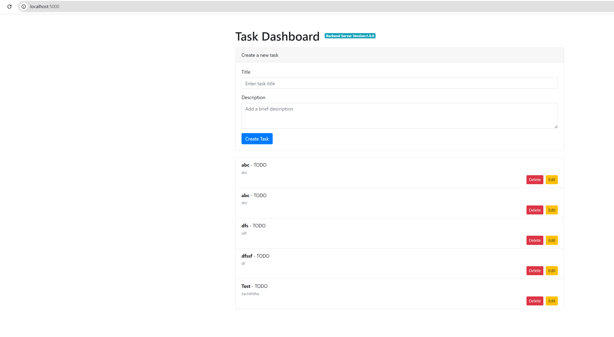
    - Manager API: http://localhost:8080/swagger-ui/index.html#/
    Sample output:
    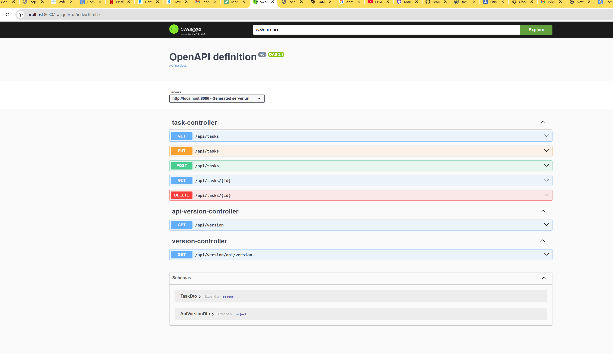
        If you see this message when opening the dashboard:
    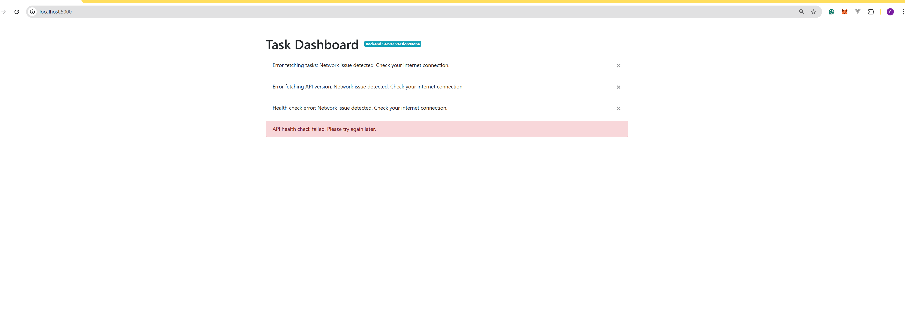

        Important: wait a few minutes for the backend and database to finish starting. The dashboard will work automatically once the API is healthy.

        Optional checks:
        - docker compose ps
        - docker compose logs -f manager mariadb
        - curl -sf http://localhost:8080/actuator/health

- Custom (inline env):
    - Custom (inline env):
        ```bash
        DATABASE_NAME=mytasks \
        DATABASE_USER=myuser \
        DATABASE_PASSWORD=mypass \
        DATABASE_PORT=3306 \
        MANAGER_PORT=9090 \
        DASHBOARD_PORT=6000 \
        docker compose up -d
        ```

    - Custom (.env file):
        Create `.env.custom`:
        ```env
        DATABASE_NAME=mytasks
        DATABASE_USER=myuser
        DATABASE_PASSWORD=mypass
        DATABASE_PORT=3306
        MANAGER_PORT=9090
        DASHBOARD_PORT=6000
        ```
    ```
    Start:
    ```bash
    docker compose --env-file .env.custom up -d
    ```

- Stop:
    ```bash
    docker compose down
    ```

## Part V — Container Orchestration with Minikube and Istio

Deploy Task Dashboard (frontend) and Task Manager (backend) locally on Kubernetes (Minikube) with Istio service mesh.

### Overview
- Components:
    - task-dashboard (v1): frontend/UI
    - task-manager (v1, v2): Spring Boot API
    - mariadb (v1): database
- Flow:
    - Browser → task-dashboard → task-manager Service → mariadb
    - Istio sidecar injection enabled; traffic flows inside the mesh

### Traffic Management (Istio)
- DestinationRule for task-manager with subsets v1 and v2 (`version: v1` / `version: v2`)
- VirtualService for task-manager: 20% to v1, 80% to v2
- No external Ingress/Gateway; use `minikube service --url` for access

### Observability
- task-manager exposes metrics at `/actuator/prometheus`
- Prometheus (Istio demo profile in `istio-system`) scrapes application metrics
- Envoy sidecars emit telemetry for Prometheus and Kiali

### 1) Prerequisites
- Windows users: use WSL2
- Install:
    - kubectl: https://kubernetes.io/docs/tasks/tools/
    - Minikube: https://minikube.sigs.k8s.io/docs/start/
    - istioctl: https://istio.io/latest/docs/setup/getting-started/#download

### 2) Start Minikube
```bash
minikube start
kubectl get nodes
```
Sample output:
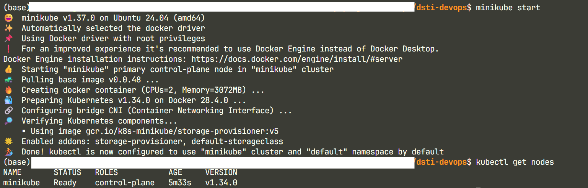

### 3) Install Istio (demo profile)
```bash
istioctl version
istioctl install --set profile=demo -y
```
Sample output:
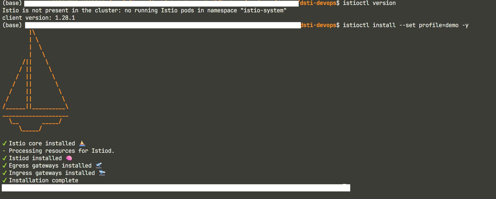

Enable sidecar injection:
```bash
kubectl label namespace default istio-injection=enabled
kubectl get namespace -L istio-injection
```
Sample output:
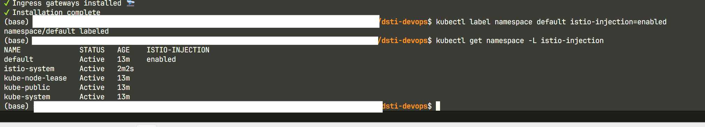

### 4) Deploy Applications
Apply manifests:
```bash
kubectl apply -k k8s/
# The resources are deployed in the default namespace for simplicty
```
Sample output:
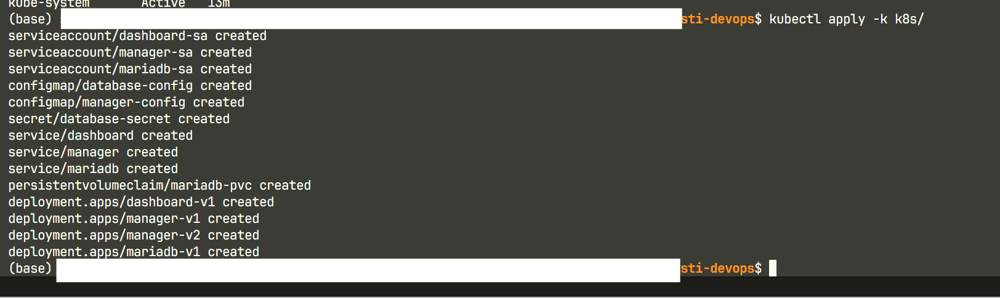

Verify:
```bash
kubectl get deployments
kubectl get pods
kubectl get svc
```
Note: Pods have 2 containers (app + Istio sidecar).
Sample output:
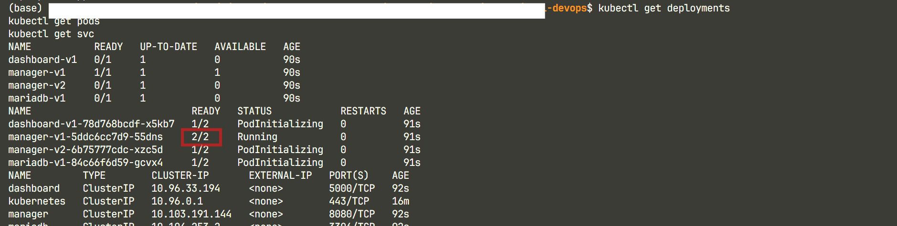

### 5) Configure Istio (traffic rules)
Apply mesh resources:
```bash
kubectl apply -k istio/
```
Sample output:
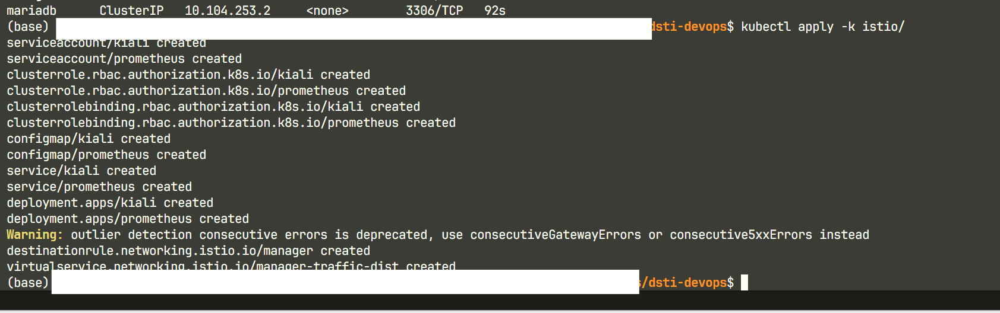

Verify:
```bash
kubectl get virtualservice
kubectl get destinationrule
kubectl get pods -n istio-system
kubectl get svc -n istio-system
```
Sample output:
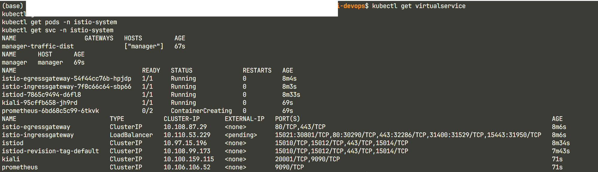

### 6) Access Services (minikube service --url)
```bash
minikube service <service-name> --url

# Use the Kubernetes Service name after the colon:
# task-dashboard: dashboard  -> run: minikube service dashboard --url
# task-manager: manager      -> run: minikube service manager --url
```

Sample outputs:
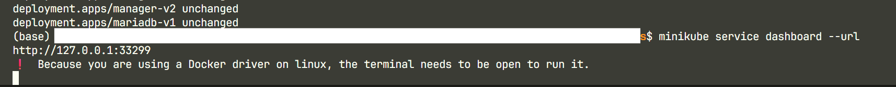
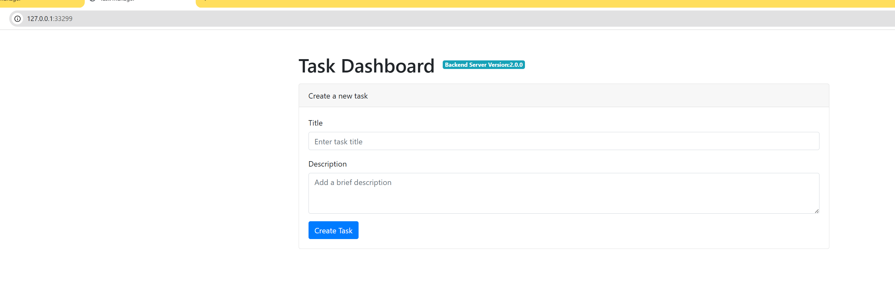
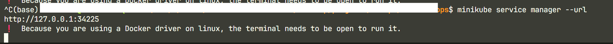
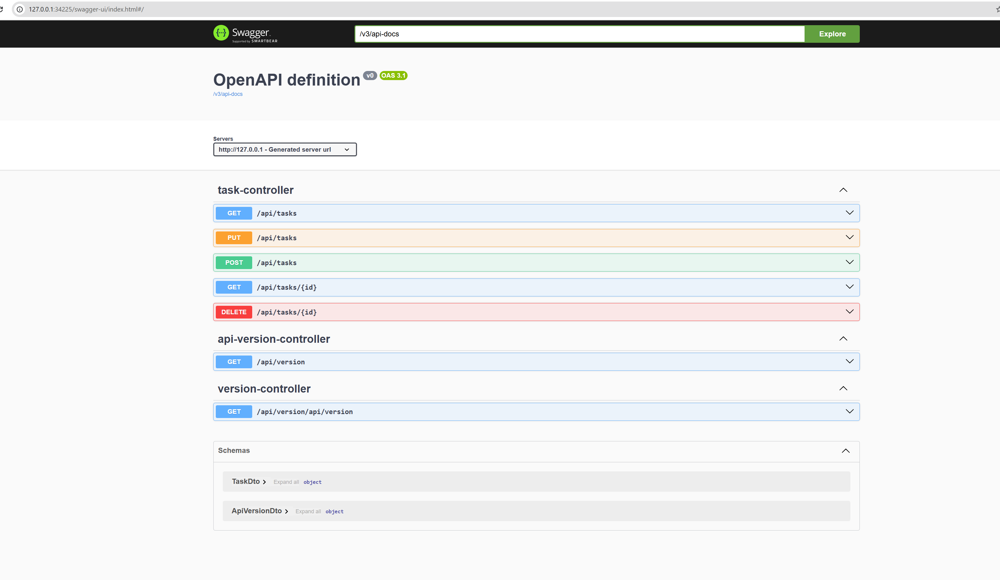

### 7) Observability

#### Prometheus
```bash
minikube service -n istio-system prometheus --url
```
Sample output :
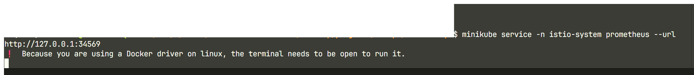
jdbc metrics scrapped from the task-mananger spring boot application
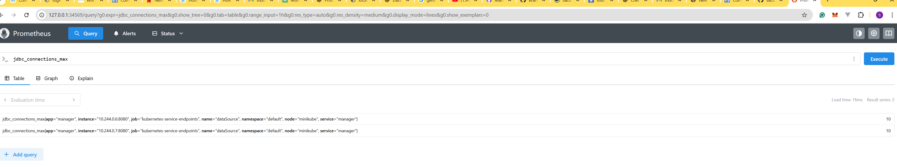

#### Kiali
```bash
minikube service -n istio-system kiali --url
```

Get Task Dashboard URL(In new terminal):
```bash
minikube service dashboard --url
```

Generate traffic (In new Terminal):
```bash
DASHBOARD_URL="<paste the URL>"
while true; do
    echo "$(date) - $(curl -s -o /dev/null -w "%{http_code}" "$DASHBOARD_URL")"
    sleep 1
done
```
Sample output:
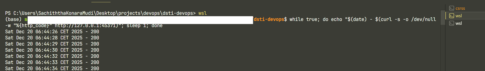
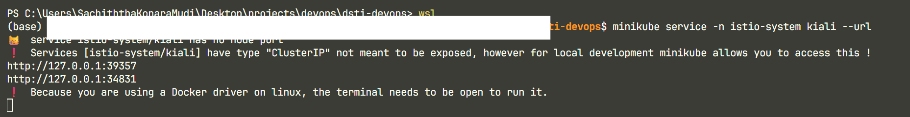
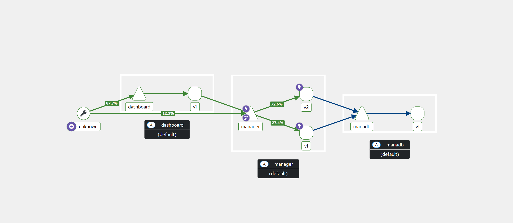

---
### AI Usage
AI was used during the project to troubleshoot errors, test quick ideas, refactor code, and in documenting the project
